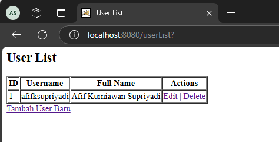

# LatihanWebMVC Project

Proyek CRUD web sederhana dengan menerapkan konsep MVC (Model-View-Controller).

## Dokumentasi

### 0. Membuat Database
Membuat database, tabel, dan menambahkan satu data user secara manual melalui query insert pada tabel.

### 1. Tampilan Awal Project
Tampilan awal project saat dijalankan, berasal dari file `index.html`.

### 2. Login Form
Tampilan login form, masukkan data:
- **Username**: `admin`
- **Password**: `admin123`

### 3. Halaman Welcome
Setelah tombol **Login** diklik, user akan diarahkan ke halaman `welcome.jsp`.

Halaman ini memiliki dua tombol:
- **Logout**: Untuk keluar dari website.
- **List User**: Menampilkan daftar data user.

### 4. Daftar User
Klik tombol **List User** untuk melihat daftar user yang ada dalam tabel database.

### 5. Edit User
Klik tombol **Edit** pada daftar user untuk mengubah data user.
#### Tampilan Form Edit Data 1

#### Tampilan Form Edit Data 2

Setelah data diubah, klik tombol **Update**.

### 6. Menambahkan User Baru
Klik tombol **Tambah User Baru** untuk membuka form penambahan user.
#### Tampilan Form Add User 1

#### Tampilan Form Add User 2

Setelah data user baru ditambahkan, halaman akan kembali ke daftar user.

### 7. Menghapus User
Klik tombol **Delete** pada daftar user untuk menghapus data user tertentu.
#### Konfirmasi Penghapusan

#### Setelah Data Terhapus

---

## Teknologi yang Digunakan
- Java
- Maven
- Apache Tomcat 10.1.29
- JSP
- MySQL

## Cara Menjalankan
1. Clone repository ini.
2. Import project ke dalam Netbeans.
3. Konfigurasi koneksi MySQL pada file `DBUtil.java`.
4. Deploy ke Apache Tomcat.
5. Buka di browser menggunakan URL yang sesuai.

---
